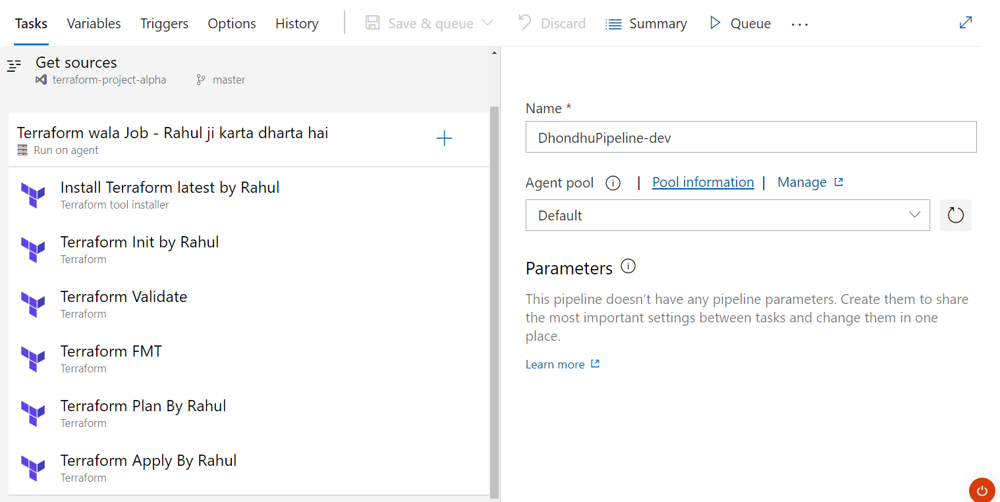

# Class Notes: Creating a Classic Pipeline with Terraform Extension in Azure DevOps

## Overview
This guide will walk you through the process of creating a classic pipeline in Azure DevOps using the Terraform extension. We will cover setting up the necessary service connections, creating and configuring the pipeline, and executing a Terraform deployment.

## Prerequisites
- An Azure DevOps organization and project.
- An Azure subscription.
- The Terraform extension installed in your Azure DevOps organization.
- Service principal credentials for Azure (client ID, client secret, tenant ID, and subscription ID).

## Step-by-Step Guide

1. **Install the Terraform Extension**
   - Navigate to your Azure DevOps organization.
   - Go to the **Marketplace** and search for "Terraform".
   - Select the "Terraform" extension by Charles Zipp.
   - Click **Get it free** and follow the prompts to install it to your organization.

2. **Create a Service Connection**
   - Go to your Azure DevOps project.
   - Click on **Project settings** in the bottom left corner.
   - Under the **Pipelines** section, click on **Service connections**.
   - Click on **New service connection**.
   - Select **Azure Resource Manager** and click **Next**.
   - Choose **Service principal (automatic)** or **Service principal (manual)** depending on your preference. For this guide, we'll use the manual method.
   - Fill in the details with your service principal credentials:
     - **Subscription ID**
     - **Subscription Name**
     - **Tenant ID**
     - **Service principal ID**
     - **Service principal key**
   - Give the service connection a meaningful name, e.g., "TerraformServiceConnection".
   - Verify the connection and click **Save**.

3. **Create a Classic Pipeline**
   - Navigate to **Pipelines** in your Azure DevOps project.
   - Click on **Create Pipeline**.
   - Select **Use the classic editor** at the bottom of the page.
   - Choose the repository where your Terraform files are stored and click **Continue**.

4. **Configure the Pipeline**
   - Choose the pipeline template **Empty job**.
   - Name your pipeline, e.g., "Terraform Deployment Pipeline".
   - **Agent Specification**: Select an agent pool. If you're unsure, use the default Azure Pipelines pool.

5. **Add Terraform Tasks**
   - Click on **+** in the **Agent job** to add a new task.
   - Search for "Terraform" and add the following tasks in sequence:
     1. **Terraform Installer**:
        - Version: Select the desired Terraform version.
     2. **Terraform Init**:
        - Display name: "Terraform Init"
        - Command: `init`
        - Working Directory: Path to your Terraform configuration files.
        - Select the service connection created earlier.
     3. **Terraform Plan**:
        - Display name: "Terraform Plan"
        - Command: `plan`
        - Working Directory: Path to your Terraform configuration files.
        - Select the service connection created earlier.
        - Save plan to file: Enable this option and provide a file name, e.g., `tfplan`.
     4. **Terraform Apply**:
        - Display name: "Terraform Apply"
        - Command: `apply`
        - Working Directory: Path to your Terraform configuration files.
        - Select the service connection created earlier.
        - Apply plan from file: Enable this option and provide the same file name used in the Plan task, e.g., `tfplan`.

6. **Configure Additional Options (Optional)**
   - **Variables**: Define any pipeline variables needed, such as environment-specific variables.
   - **Triggers**: Set up triggers to automatically run the pipeline on code commits or pull requests.
   - **Retention**: Configure retention policies for pipeline runs.

7. **Save and Queue the Pipeline**
   - Click on **Save & queue**.
   - Provide a commit message and select the branch to save the pipeline configuration.
   - Click **Save and run** to start the pipeline.

8. **Monitor the Pipeline**
   - Navigate to the **Pipelines** section to monitor the pipeline's progress.
   - Check logs for each task to ensure everything runs smoothly.
   - Upon successful completion, verify that your Terraform infrastructure changes are applied in your Azure subscription.

## Conclusion
By following these steps, you have created a classic pipeline in Azure DevOps that uses the Terraform extension to automate infrastructure deployments. This pipeline can be customized further to suit your specific needs, such as adding approval gates, notifications, or additional tasks.

