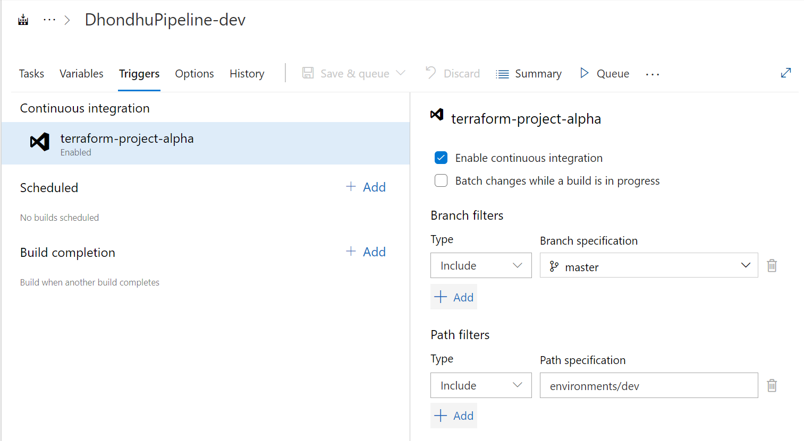

### Class Notes: Triggers in Azure Classic Pipelines

#### Overview
In Azure DevOps, a trigger is an event that causes a pipeline to run. Triggers can be configured to start builds automatically when changes are made to the codebase, ensuring continuous integration and deployment. In the context of Azure Classic Pipelines, triggers play a crucial role in automating the build and release process.

#### Types of Triggers

1. **CI (Continuous Integration) Triggers**:
   - Automatically trigger a build when code changes are pushed to a repository.
   - Ensure that the code is always in a deployable state by frequently integrating changes.

2. **Scheduled Triggers**:
   - Trigger builds at specified times, such as nightly builds.
   - Useful for running tests and other tasks at regular intervals.

3. **Pull Request (PR) Triggers**:
   - Trigger builds when a pull request is created or updated.
   - Ensure that code changes in pull requests meet the necessary quality and integration standards before merging.

#### Configuring CI Triggers in Classic Pipelines

##### From a Specific Branch
To configure a CI trigger for a specific branch, you need to define which branch should trigger the build. This can be done using the Azure DevOps classic pipeline editor.

1. **Open the Pipeline Editor**:
   - Navigate to the Azure DevOps project.
   - Go to Pipelines > Builds.
   - Select the pipeline you want to configure.
   - Click on "Edit" to open the pipeline editor.

2. **Configure the Trigger**:
   - In the pipeline editor, click on the "Triggers" tab.
   - Enable the "Continuous integration" trigger.
   - Specify the branch name that should trigger the build. For example, `refs/heads/main` to trigger builds on changes to the main branch.
   - Save the changes.

##### From a Specific Path
To configure a CI trigger for changes in a specific path, you need to set up path filters. This ensures that only changes to certain parts of the repository will trigger a build.

1. **Open the Pipeline Editor**:
   - Follow the same steps as above to navigate to the pipeline editor.

2. **Configure the Path Filter**:
   - In the "Triggers" tab, enable the "Continuous integration" trigger if not already enabled.
   - Click on "Path filters".
   - Add the paths that should trigger the build. For example, to trigger builds for changes in the `src` directory, add `src/*`.
   - Save the changes.

#### Benefits of CI Triggers
- **Automation**: Reduces manual intervention by automatically triggering builds.
- **Early Detection**: Catches integration issues early by frequently building and testing code changes.
- **Consistency**: Ensures that the codebase is always in a deployable state.

#### Best Practices
- **Branch Policies**: Implement branch policies to enforce quality standards and integrate CI triggers with pull requests.
- **Path Filters**: Use path filters to optimize build times by only triggering builds for relevant changes.
- **Build Notifications**: Set up notifications to stay informed about build status and failures.

By understanding and configuring triggers in Azure Classic Pipelines, you can enhance your DevOps processes and ensure a smooth and efficient CI/CD pipeline.