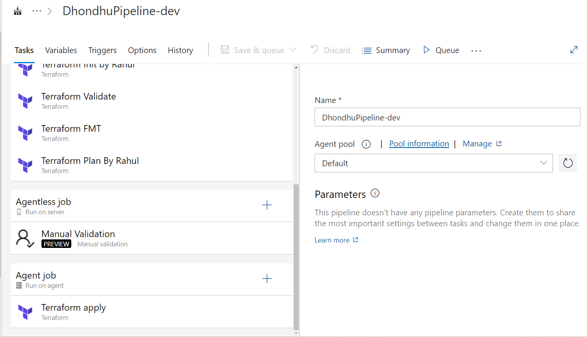

# Agent Job

An **Agent Job** in Azure DevOps is a collection of tasks that run sequentially on an agent. Agents are installed on machines and are responsible for executing the jobs defined in your pipeline. Here are some key points about agent jobs:

- **Agent Pool**: Agent jobs run on agents that are part of an agent pool. Agent pools can contain self-hosted or Microsoft-hosted agents.
- **Tasks**: Tasks within an agent job can include anything from building code, running tests, deploying applications, and more.
- **Dependencies**: Tasks within an agent job can have dependencies, meaning one task can wait for another to complete before starting.
- **Environment**: Agent jobs run in an environment specified by the agent, which can include specific OS, installed software, and network configurations.

# Agentless Job
An **Agentless Job** runs tasks that do not require a build agent. These jobs are useful for tasks that are purely server-side operations, such as approvals or manual interventions. Key points include:

- **Server-Side Tasks**: Agentless jobs run tasks on the Azure DevOps server instead of a build agent.
- **Manual Interventions**: Commonly used for manual approval steps, where human intervention is required to proceed with the pipeline.
- **No Resource Consumption**: Since these jobs do not use build agents, they do not consume agent resources.

# Manual Approval Task
A **Manual Approval Task** is a way to include human intervention in your pipeline. This task pauses the pipeline execution until a designated user approves or rejects the continuation of the pipeline. Important aspects are:

- **Approval Request**: Sends a notification to the approvers defined in the task configuration.
- **Approvers**: A list of users or groups who can approve or reject the task.
- **Timeout**: Specifies how long the task waits for an approval before timing out and failing the pipeline.
- **Comments**: Approvers can leave comments when they approve or reject the task, providing context for their decision.

# Adding TFSec in Azure Classic Pipeline
TFSec is a static analysis security scanner for Terraform code. To integrate TFSec in an Azure DevOps classic pipeline, follow these steps:

1. **Install TFSec**: Ensure that TFSec is installed on the agent. You can use a script task to install TFSec if it's not already available.

2. **Create a Task to Run TFSec**:
    - **Add a Command Line Task**: Use this task to execute TFSec commands.
    - **Script Path**: Specify the path to the TFSec executable.
    - **Arguments**: Include the necessary arguments for running TFSec, such as the directory of your Terraform code.

3. **Analyze the Output**:
    - **Success Criteria**: Define what constitutes a successful run of TFSec (e.g., no high-severity issues found).
    - **Error Handling**: Decide how to handle any security issues detected by TFSec. You can fail the pipeline if issues are found or log the issues for further review.

By incorporating TFSec in your pipeline, you can ensure that your Terraform code is analyzed for security vulnerabilities before deployment, enhancing the security posture of your infrastructure as code.

These notes cover the essentials of agent jobs, agentless jobs, manual approval tasks, and the integration of TFSec in Azure DevOps classic pipelines without delving into YAML code specifics.