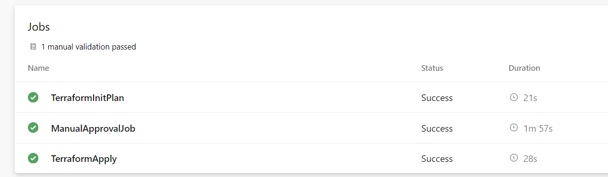

### Azure Pipeline with Jobs



This YAML pipeline, named `MeriPyariPipeline`, is configured to run on the `Default` pool and is triggered by changes to the `master` and `develop` branches. The pipeline includes three jobs: `Job1` for initializing and planning Terraform, `ManualApprovalJob` for manual validation, and `Job2` for applying the Terraform configuration.

#### Pipeline Structure

1. **Name and Pool**
   ```yaml
   name: MeriPyariPipeline
   pool: Default
   ```

   - `name`: Sets the name of the pipeline.
   - `pool`: Specifies the pool where the pipeline will run. Here, it's set to `Default`.

2. **Triggers**
   ```yaml
   trigger: 
   - master
   - develop
   ```

   - `trigger`: Defines the branches that will trigger the pipeline. This pipeline is triggered by commits to the `master` and `develop` branches.

#### Jobs

##### Job 1: Terraform Initialization and Planning
```yaml
jobs: 
- job: Job1
  displayName: "TerraformInitPlan"
  steps: 
  - task: TerraformInstaller@1
    inputs:
      terraformVersion: 'latest'
  - task: TerraformTaskV4@4
    inputs:
      provider: 'azurerm'
      command: 'init'
      workingDirectory: '$(System.DefaultWorkingDirectory)/environments/dev'
      backendServiceArm: 'Ratan-SC'
      backendAzureRmResourceGroupName: 'pkrg'
      backendAzureRmStorageAccountName: 'mystorage12345126'
      backendAzureRmContainerName: 'pkcontainer'
      backendAzureRmKey: 'dhondhu007.tfstate'
  - task: TerraformTaskV4@4
    inputs:
      provider: 'azurerm'
      command: 'plan'
      workingDirectory: '$(System.DefaultWorkingDirectory)/environments/dev'
      environmentServiceNameAzureRM: 'Ratan-SC'
```
- `job: Job1`: Defines the first job with the display name "TerraformInitPlan".
- **Steps**:
  - **Terraform Installer**:
    ```yaml
    - task: TerraformInstaller@1
      inputs:
        terraformVersion: 'latest'
    ```
    - Installs the latest version of Terraform.
  - **Terraform Init**:
    ```yaml
    - task: TerraformTaskV4@4
      inputs:
        provider: 'azurerm'
        command: 'init'
        workingDirectory: '$(System.DefaultWorkingDirectory)/environments/dev'
        backendServiceArm: 'Ratan-SC'
        backendAzureRmResourceGroupName: 'pkrg'
        backendAzureRmStorageAccountName: 'mystorage12345126'
        backendAzureRmContainerName: 'pkcontainer'
        backendAzureRmKey: 'dhondhu007.tfstate'
    ```
    - Initializes the Terraform configuration with Azure as the backend provider.
  - **Terraform Plan**:
    ```yaml
    - task: TerraformTaskV4@4
      inputs:
        provider: 'azurerm'
        command: 'plan'
        workingDirectory: '$(System.DefaultWorkingDirectory)/environments/dev'
        environmentServiceNameAzureRM: 'Ratan-SC'
    ```
    - Creates a Terraform execution plan.

##### Job 2: Manual Approval
```yaml
- job: ManualApprovalJob
  dependsOn: Job1
  pool: server
  steps:
  - task: ManualValidation@1
    inputs:
      notifyUsers: 'abc@abc.com'
      instructions: 'bhai terraform plan dekh le... nahi to infra fatt jaega..'
```
- `job: ManualApprovalJob`: Defines a manual approval job dependent on the successful completion of `Job1`.
- **Steps**:
  - **Manual Validation**:
    ```yaml
    - task: ManualValidation@1
      inputs:
        notifyUsers: 'abc@abc.com'
        instructions: 'bhai terraform plan dekh le... nahi to infra fatt jaega..'
    ```
    - Notifies the specified user(s) to manually validate the Terraform plan.

##### Job 3: Terraform Apply
```yaml
- job: Job2
  dependsOn: ManualApprovalJob
  displayName: "TerraformApply"
  pool: Default
  steps: 
  - task: TerraformTaskV4@4
    inputs:
      provider: 'azurerm'
      command: 'init'
      workingDirectory: '$(System.DefaultWorkingDirectory)/environments/dev'
      backendServiceArm: 'Ratan-SC'
      backendAzureRmResourceGroupName: 'pkrg'
      backendAzureRmStorageAccountName: 'mystorage12345126'
      backendAzureRmContainerName: 'pkcontainer'
      backendAzureRmKey: 'dhondhu007.tfstate'  
  - task: TerraformTaskV4@4
    inputs:
      provider: 'azurerm'
      command: 'apply'
      workingDirectory: '$(System.DefaultWorkingDirectory)/environments/dev'
      environmentServiceNameAzureRM: 'Ratan-SC'
```
- `job: Job2`: Defines the third job with the display name "TerraformApply", dependent on the successful completion of `ManualApprovalJob`.
- **Steps**:
  - **Terraform Init**:
    ```yaml
    - task: TerraformTaskV4@4
      inputs:
        provider: 'azurerm'
        command: 'init'
        workingDirectory: '$(System.DefaultWorkingDirectory)/environments/dev'
        backendServiceArm: 'Ratan-SC'
        backendAzureRmResourceGroupName: 'pkrg'
        backendAzureRmStorageAccountName: 'mystorage12345126'
        backendAzureRmContainerName: 'pkcontainer'
        backendAzureRmKey: 'dhondhu007.tfstate'
    ```
    - Initializes the Terraform configuration again to ensure the backend is configured.
  - **Terraform Apply**:
    ```yaml
    - task: TerraformTaskV4@4
      inputs:
        provider: 'azurerm'
        command: 'apply'
        workingDirectory: '$(System.DefaultWorkingDirectory)/environments/dev'
        environmentServiceNameAzureRM: 'Ratan-SC'
    ```
    - Applies the Terraform plan to create or update the infrastructure as specified in the configuration files.