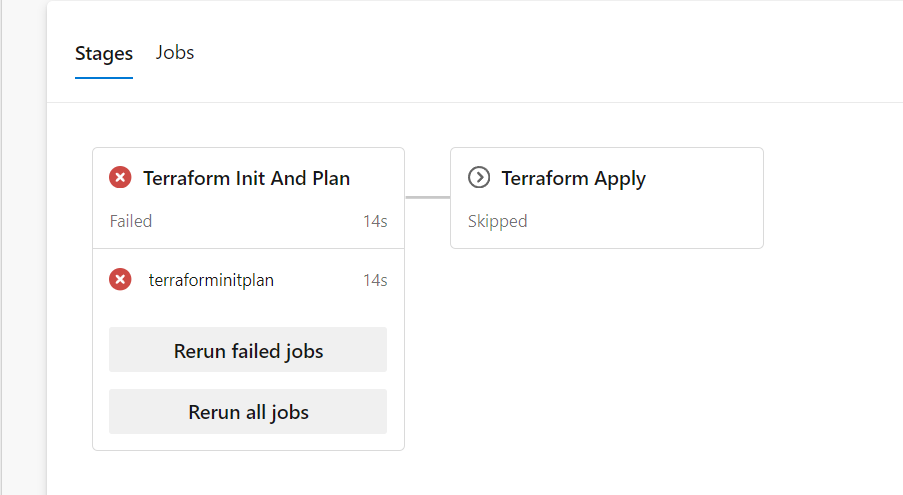

## Azure Pipeline with Stages: Terraform Init, Plan, and Apply



**Pipeline Overview:**

This pipeline is divided into two main stages:
1. **terraforminitandplan** - Initializes and plans the Terraform deployment.
2. **terraformapply** - Applies the Terraform plan after a manual approval step.

Each stage consists of jobs that execute specific tasks. Let's break down the code to understand each component.

**Code Breakdown:**

```yaml
pool: Default
```
- **pool:** Defines the agent pool to run the pipeline. Here, the default agent pool is used.

```yaml
trigger: none
```
- **trigger:** Specifies the condition to trigger the pipeline. 'none' means the pipeline won't run automatically on any code push.

**Stage 1: terraforminitandplan**

```yaml
stages:
- stage: terraforminitandplan
  displayName: Terraform Init And Plan
  pool: Default
  jobs: 
  - job: terraforminitplan
    steps: 
    - task: TerraformTaskV4@4
      inputs:
        provider: 'azurerm'
        command: 'init'
        workingDirectory: '$(System.DefaultWorkingDirectory)/environments/dev'
        backendServiceArm: 'Ratan-SC'
        backendAzureRmResourceGroupName: 'pkrg'
        backendAzureRmStorageAccountName: 'mystorage12345126'
        backendAzureRmContainerName: 'pkcontainer'
        backendAzureRmKey: 'bhondhu.tfstate'
    - task: TerraformTaskV4@4
      inputs:
        provider: 'azurerm'
        command: 'plan'
        workingDirectory: '$(System.DefaultWorkingDirectory)/environment/dev'
        environmentServiceNameAzureRM: 'Ratan-SC'
```

- **stage: terraforminitandplan**: This stage is named 'terraforminitandplan' and is displayed as 'Terraform Init And Plan'.
- **jobs:** Defines the set of jobs to be executed in this stage.
  - **job: terraforminitplan**: The job name within this stage.
    - **steps:** Steps define individual tasks within the job.
      - **task: TerraformTaskV4@4**: Specifies the Terraform task version 4.
        - **inputs:** Provides the necessary inputs for the task.
          - **provider:** Specifies the cloud provider ('azurerm' for Azure).
          - **command:** Command to be executed by Terraform ('init' for initialization).
          - **workingDirectory:** Directory containing the Terraform configuration files.
          - **backendServiceArm:** Azure service connection name.
          - **backendAzureRmResourceGroupName:** Resource group in Azure for the Terraform state.
          - **backendAzureRmStorageAccountName:** Storage account for the Terraform state.
          - **backendAzureRmContainerName:** Container in the storage account for the state file.
          - **backendAzureRmKey:** Name of the state file.
      - The second **TerraformTaskV4@4** task runs the 'plan' command to create an execution plan.

**Stage 2: terraformapply**

```yaml
- stage: terraformapply
  dependsOn: terraforminitandplan
  displayName: Terraform Apply
  jobs: 
  - job: ManualApproval
    displayName: Manual Approval
    pool: server 
    steps: 
    - task: ManualValidation@1
      inputs:
        notifyUsers: 'abc@abc.com'
        instructions: 'Bhai pichli stage me plan check karle.'
  - job: TerraformApply
    dependsOn: ManualApproval
    displayName: Terraform Apply
    steps: 
    - task: TerraformTaskV4@4
      inputs:
        provider: 'azurerm'
        command: 'init'
        workingDirectory: '$(System.DefaultWorkingDirectory)/environments/dev'
        backendServiceArm: 'Ratan-SC'
        backendAzureRmResourceGroupName: 'pkrg'
        backendAzureRmStorageAccountName: 'mystorage12345126'
        backendAzureRmContainerName: 'pkcontainer'
        backendAzureRmKey: 'bhondhu.tfstate'
      
    - task: TerraformTaskV4@4
      inputs:
        provider: 'azurerm'
        command: 'apply'
        workingDirectory: '$(System.DefaultWorkingDirectory)/environments/dev'
        environmentServiceNameAzureRM: 'Ratan-SC'
```

- **stage: terraformapply**: This stage is named 'terraformapply' and is displayed as 'Terraform Apply'.
- **dependsOn: terraforminitandplan**: This stage depends on the successful completion of the 'terraforminitandplan' stage.
- **jobs:** Defines the set of jobs to be executed in this stage.
  - **job: ManualApproval**: The first job within this stage is 'ManualApproval'.
    - **displayName:** Displayed as 'Manual Approval'.
    - **pool:** Specifies the agent pool, here 'server' indicates no agent is needed.
    - **steps:** Steps define individual tasks within the job.
      - **task: ManualValidation@1**: Manual validation task.
        - **inputs:** Provides the necessary inputs for the task.
          - **notifyUsers:** Specifies the email addresses to notify.
          - **instructions:** Instructions for the manual approval step.
  - **job: TerraformApply**: The second job within this stage is 'TerraformApply'.
    - **dependsOn: ManualApproval**: This job depends on the successful completion of the 'ManualApproval' job.
    - **displayName:** Displayed as 'Terraform Apply'.
    - **steps:** Steps define individual tasks within the job.
      - The first **TerraformTaskV4@4** task runs the 'init' command to reinitialize the Terraform environment.
      - The second **TerraformTaskV4@4** task runs the 'apply' command to apply the Terraform plan.

---

This pipeline is structured to first initialize and plan the Terraform deployment, then waits for manual approval before applying the planned changes. This ensures that any changes are reviewed before they are applied to the environment.